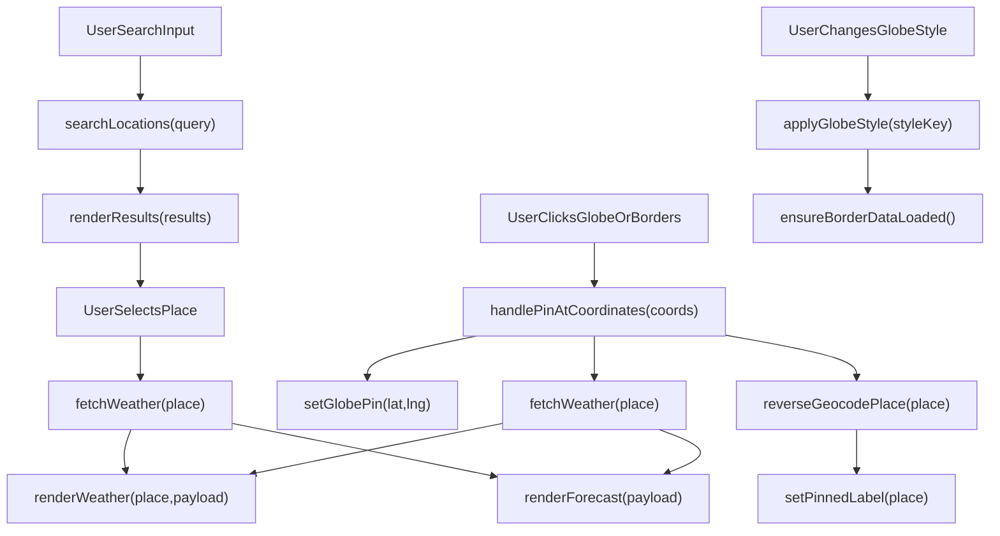

# Global Real-Time Weather Web App

A simple web app to search **any city/state/country/region globally** and view current weather with a **7-day forecast**.

## Live Demo

- Website: `https://akash12111998.github.io/weather-realtime-app/`
- Repository: `https://github.com/akash12111998/weather-realtime-app`

## Features

- Global location lookup (city, state, country, region)
- 3D interactive globe (click anywhere to pinpoint a weather location)
- Larger and brighter globe view with colorful Earth texture + topography bump map
- Globe style switcher: Satellite / Satellite + Labels / Topographic / Night / Borders (Intl + Domestic) / Cartographic Light / Cartographic Dark
  - Borders mode includes colorful political fills + country and state/province names
- Reverse geocoding on globe click (shows nearest city/state/country)
- Real-time weather details
- 7-day forecast (daily condition, high/low, rain chance)
- 24-hour temperature trend chart
- Current location weather using browser geolocation
- Air quality panel (US AQI, PM2.5, PM10, ozone)
- Sunrise, sunset, and UV max summary
- Smart severe-condition alerts (wind, storm, UV, AQI)
- Responsive layout for mobile and tablet screens
  - Includes landscape-mobile optimization for better globe visibility and control spacing
- Improved globe zoom stability and clearer pin marker with animated highlight rings
- Reset View control to recenter the globe and resume auto-rotation
- Expanded unit controls: temperature, wind, precipitation, pressure
- No paid API required (uses free Open-Meteo APIs)

## APIs Used

- Geocoding: `https://geocoding-api.open-meteo.com/v1/search`
- Weather: `https://api.open-meteo.com/v1/forecast`
- Air quality: `https://air-quality-api.open-meteo.com/v1/air-quality`
- Reverse geocoding for pinned points: `https://api.bigdatacloud.net/data/reverse-geocode-client`
- 3D globe rendering library (CDN): `https://unpkg.com/globe.gl`

These are free and do not require credit card setup.

## How To Use

1. Type a location and select a match, **or**
2. Click directly on the 3D globe to pin coordinates.
3. The app updates the same weather panel with:
   - current weather
   - AQI + sunrise/sunset + UV
   - severe-condition alerts (if triggered)
   - 24-hour trend chart
   - 7-day forecast
4. Use the globe style dropdown to switch between **Satellite**, **Satellite + Labels**, **Topographic**, **Night**, **Borders (Intl + Domestic)**, **Cartographic Light**, and **Cartographic Dark** views.
   - A small status message appears while border layers are loading.
   - Borders mode shows country names and state/province names on the globe.
5. After globe click, the app resolves and shows nearest **city/state/country**; if unavailable, it falls back to coordinates.
6. Change Celsius/Fahrenheit from the dropdown to re-fetch data for the last selected or pinned location.
7. Click **Reset View** to recenter the globe and resume auto-rotation.
8. Click **Use My Location** to instantly load local weather and AQI.

## Weather Data Included

- **Current weather**
  - Temperature
  - Feels like
  - Humidity
  - Wind speed
  - Pressure
  - Precipitation
  - Cloud cover
  - Condition code mapped to readable text
- **7-day forecast**
  - Daily weather condition
  - Max and min temperature
  - Maximum precipitation probability

## Responsive Support

The app is optimized for desktop, tablet, and mobile screens.

- **Tablet / small laptop (`<=1024px`)**
  - Container spacing is reduced for better use of screen width.
  - Globe height scales down to keep controls and forecast visible.

- **Mobile (`<=768px`)**
  - Search input and button stack vertically for easier tapping.
  - Unit/style controls wrap and use full-width selects.
  - Weather and forecast cards use tighter responsive grids.

- **Small mobile (`<=480px`)**
  - Typography and card spacing are compacted.
  - Globe height is reduced to fit key controls on screen.

- **Landscape mobile (`<=900px` + landscape)**
  - Globe height is further reduced to avoid taking over the viewport.
  - Header and section spacing are tightened for faster access to weather data.

## Run Locally

### Option 1: Open directly

Open `index.html` in your browser.

Note: the globe library loads from CDN, so internet access is required.

### Option 2: Use a local server (recommended)

From this project folder:

```bash
python3 -m http.server 5500
```

Then open:

`http://localhost:5500`

## Project Structure

- `index.html` - App UI
- `styles.css` - Styling
- `script.js` - Globe click-to-pin + location search + current weather + 7-day forecast logic

## Technical Reference (Classes, Objects, Functions)

### Classes

- **JavaScript classes:** none (project uses functional JavaScript and plain objects).
- **CSS classes used (UI):**
  - `.container` - main app wrapper
  - `.app-header` - title/subtitle section
  - `.search-panel` - search + controls area
  - `.globe-section` - globe module wrapper
  - `.globe-toolbar` - globe style selector row
  - `.globe-style-status` - border-style loading status text
  - `.globe-view` - globe canvas container
  - `.pinned-coords` - selected coordinate/place label
  - `.toolbar` - shared inline control layout
  - `.section-title` - section headings
  - `.results-list` - location search result list
  - `.result-btn` / `.result-sub` - result item and metadata
  - `.weather-section` - weather result panel
  - `.weather-grid` - current-weather card grid
  - `.card` / `.card-label` / `.card-value` - weather cards
  - `.forecast-title` / `.forecast-grid` / `.forecast-card` / `.forecast-day` / `.forecast-sub` - 7-day forecast UI
  - `.status-message` - app status line
  - `.updated-at` - data timestamp text
  - `.hidden` - utility class to hide elements
  - `.sr-only` - accessibility helper for screen-reader-only labels

### Core Objects and Constants

- **DOM element reference constants**  
  - **What they do:** store references to UI nodes for updates and event wiring (`form`, `input`, `resultsList`, `weatherSection`, `selectedLocation`, `weatherGrid`, `forecastGrid`, `globeView`, `pinnedCoords`, `globeStyleSelect`, `globeStyleStatus`, `statusMessage`, `updatedAt`, `unitSelect`).  
  - **Input:** DOM lookup by element id (`document.getElementById(...)`).  
  - **Output:** HTML element references or `null` (if element is missing).

- **State variables (`lastSelectedLocation`, `globe`, `latestPinRequestId`, `latestStyleRequestId`, `borderDataPromise`)**  
  - **What they do:** keep mutable app state for selected place, globe instance, request ordering guards, and lazy-loaded border cache.  
  - **Input:** updated during user interactions and async calls.  
  - **Output:** in-memory state used by render/fetch logic.

- `weatherCodeMap`  
  - **What it does:** maps Open-Meteo weather codes to readable condition text.  
  - **Input:** numeric weather code.  
  - **Output:** condition string (e.g., `Overcast`).

- `globeStyles`  
  - **What it does:** defines style presets (textures, atmosphere, overlay behavior).  
  - **Input:** selected style key from dropdown.  
  - **Output:** style config used by globe renderer.

- `defaultOverlayState`  
  - **What it does:** fallback empty border/label data if border datasets fail to load.  
  - **Input:** none.  
  - **Output:** `{ countries: [], domesticPaths: [], countryLabels: [], stateLabels: [] }`.

- URL constants (`countryBordersGeoJsonUrl`, `domesticBordersGeoJsonUrl`)  
  - **What they do:** point to border datasets for international and domestic boundaries.  
  - **Input:** none.  
  - **Output:** fetched GeoJSON data used in Borders/Cartographic styles.

### Functions in `script.js`

- `setStatus(message)`  
  - **Input:** `message: string`  
  - **Output:** none (updates status text in UI).

- `setGlobeStyleStatus(message, isError = false)`  
  - **Input:** `message: string`, `isError: boolean`  
  - **Output:** none (shows/hides style-load status text).

- `formatCoordinate(value)`  
  - **Input:** `value: number|string`  
  - **Output:** `string` fixed to 2 decimals.

- `getLocationText(place)`  
  - **Input:** `place: { name?, admin1?, country? }`  
  - **Output:** combined location string.

- `getCoordinateSummary(lat, lng)`  
  - **Input:** `lat: number`, `lng: number`  
  - **Output:** coordinate label string.

- `clearGlobePin()`  
  - **Input:** none  
  - **Output:** none (clears active globe pin and label).

- `coordsToLatLngPairs(lineCoords)`  
  - **Input:** array of `[lng, lat]` coordinate pairs  
  - **Output:** array of `{ lat, lng }`.

- `getFeatureName(properties, keys)`  
  - **Input:** GeoJSON properties object + ordered candidate key list  
  - **Output:** first non-empty name string.

- `getRingCentroid(ring)`  
  - **Input:** polygon ring coordinates  
  - **Output:** centroid `{ lat, lng }` or `null`.

- `getGeometryCentroid(geometry)`  
  - **Input:** GeoJSON geometry (`Polygon`, `MultiPolygon`, `LineString`, `MultiLineString`)  
  - **Output:** centroid `{ lat, lng }` or `null`.

- `getColorFromName(name)`  
  - **Input:** `name: string`  
  - **Output:** deterministic RGBA fill color string.

- `extractDomesticPaths(geoJson)`  
  - **Input:** domestic boundary GeoJSON  
  - **Output:** normalized path objects for line rendering.

- `ensureBorderDataLoaded()` *(async)*  
  - **Input:** none  
  - **Output:** overlay data object with countries, paths, and labels.

- `clearBorderOverlays()`  
  - **Input:** none  
  - **Output:** none (clears polygons/paths/labels layers).

- `applyGlobeStyle(styleKey)` *(async)*  
  - **Input:** `styleKey: string`  
  - **Output:** none (applies style + optional overlays/labels).

- `setGlobePin(lat, lng)`  
  - **Input:** `lat: number`, `lng: number`  
  - **Output:** none (renders pin and updates pinned label).

- `setPinnedLabel(place)`  
  - **Input:** `place` object  
  - **Output:** none (updates pinned text to region name).

- `handlePinAtCoordinates(coords)` *(async)*  
  - **Input:** `{ lat, lng }`  
  - **Output:** none (pins location, fetches weather, reverse geocodes).

- `reverseGeocodePlace(place)` *(async)*  
  - **Input:** `place` with coordinates  
  - **Output:** enriched `place` with city/state/country if available.

- `initializeGlobe()`  
  - **Input:** none  
  - **Output:** none (initializes globe, handlers, resize sync, style switching).

- `renderResults(results)`  
  - **Input:** array of geocoding results  
  - **Output:** none (renders selectable location list).

- `getSpeedUnit()`  
  - **Input:** none (reads selected temp unit)  
  - **Output:** wind unit string (`kmh` or `mph`).

- `getPrecipitationUnit()`  
  - **Input:** none (reads selected temp unit)  
  - **Output:** precipitation unit string (`mm` or `inch`).

- `renderWeather(place, payload)`  
  - **Input:** selected `place`, Open-Meteo response `payload`  
  - **Output:** none (renders current weather cards).

- `formatDay(dateString)`  
  - **Input:** date string (ISO day)  
  - **Output:** formatted day label string.

- `renderForecast(payload)`  
  - **Input:** Open-Meteo response `payload`  
  - **Output:** none (renders 7-day forecast cards).

- `fetchWeather(place)` *(async)*  
  - **Input:** `place` with coordinates  
  - **Output:** none (requests weather API + renders current/forecast).

- `searchLocations(query)` *(async)*  
  - **Input:** `query: string`  
  - **Output:** none (requests geocoding API + renders matches).

## Call Flow (High-Level)


